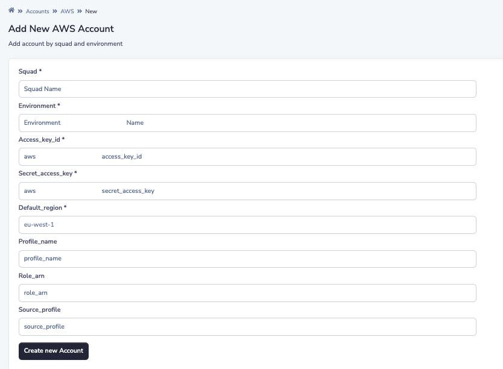
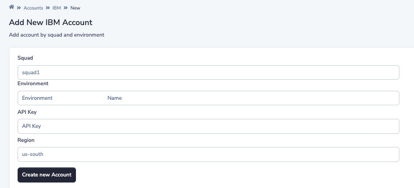
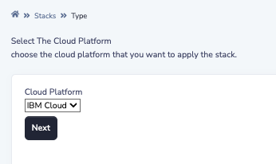

# SLD

# 1. How to install SLD?

for the machine, I recommend `t2.medium` (at least 2 vCPU, 4 G Memory).

## 1.1 install docker

maybe you can create a bash file and paste these commands.

```bash
sudo vim install.sh
```

Paste these commands.

```BASH
sudo apt-get -y remove docker docker-engine docker.io containerd runc
sudo apt-get -y update
sudo apt-get -y install \
    ca-certificates \
    curl \
    gnupg \
    lsb-release
sudo mkdir -p /etc/apt/keyrings
curl -fsSL https://download.docker.com/linux/ubuntu/gpg | sudo gpg --dearmor -o /etc/apt/keyrings/docker.gpg
echo \
  "deb [arch=$(dpkg --print-architecture) signed-by=/etc/apt/keyrings/docker.gpg] https://download.docker.com/linux/ubuntu \
  $(lsb_release -cs) stable" | sudo tee /etc/apt/sources.list.d/docker.list > /dev/null
sudo apt-get -y update
sudo apt-get -y install docker-ce docker-ce-cli containerd.io docker-compose-plugin
sudo curl -L "https://github.com/docker/compose/releases/download/1.28.5/docker-compose-$(uname -s)-$(uname -m)" -o /usr/local/bin/docker-compose
sudo chmod +x /usr/local/bin/docker-compose
```

execute it

```bash
sudo sh install.sh
```

## 1.2 Clone the code 

```bash
git clone https://github.com/Biodepot-LLC/Stack-Lifecycle-Deployment.git
```

## 1.3 Configuration

### AWS

1. **get your access key**

Click `Security credentials -> Access keys (access key ID and secret access key) ->  Create New Access Key` and Save it.

2. **modify configuration**

```bash
cd Stack-Lifecycle-Deployment/sld-dashboard
nano .env
```

Fulfill `SLD_AWS_ACCESS_KEY` and `SLD_AWS_SECRET_KEY`.

### IBM

**install IBM Cloud CLI** (Not required)

install IBM Cloud CLI, and login in.

The latest version of the IBM Cloud CLI is installed when you run the command. As the CLI installs, keep an eye on the command line to authenticate as needed.

- For MacOS, run the following command:

  ```
  curl -fsSL https://clis.cloud.ibm.com/install/osx | sh
  ```

- For Linux™, run the following command:

  ```
  curl -fsSL https://clis.cloud.ibm.com/install/linux | sh
  ```

- For Windows™ 10 Pro, run the following command in PowerShell as an administrator:

  ```
  iex(New-Object Net.WebClient).DownloadString('https://clis.cloud.ibm.com/install/powershell')
  ```

2. **Get the Api Key**

   You can create an IBM Cloud API key by using [IBM Cloud Identity and Access Management (IAM)](https://cloud.ibm.com/docs/account?topic=account-iamoverview), as in the following steps:

   1. Ensure that you are logged in to the same IBM Cloud account as the App Connect on IBM Cloud instance that your deployed integration will need to communicate with.

   2. Create an API key as follows:

      1. Click **Manage** > **Access (IAM)** > **API keys** to open the “API keys” page (URL: https://cloud.ibm.com/iam/apikeys).
      2. Ensure that **My IBM Cloud API keys** is selected in the **View** list.
      3. Click **Create an IBM Cloud API key**, and then specify a name and description.
      4. Click **Create**
      5. Click **Download** to download the API key to a file named apiKey.json in your browser’s default location for later use.

      the JSON would be like this:

      ```json
      {
      	"id": "ApiKey-f7d82b61-89f8-4d16-95e5-fb5973503584",
      	"crn": "crn:v1:bluemix:public:iam-identity::a/33e4f3d8548c4818b0be0b12beb73fa1F-2462852F::apikey:ApiKey-f7d82b61-89f8-4d16-95e5-fb5973503584",
      	"iam_id": "IBMid-6680003SI8",
      	"account_id": "33e4f3d8548c4818b0be0b12beb73fa1",
      	"name": "gczhao",
      	"description": "",
      	"apikey": "",
      	"locked": false,
      	"entity_tag": "1-41d18dd2ce0366752af3eaae596be90e",
      	"created_at": "2022-08-18T20:33+0000",
      	"created_by": "IBMid-6680003SI8",
      	"modified_at": "2022-08-18T20:33+0000"
      }
      ```

      

**modify configuration**

Find `apikey` from the JSON file and add it to ` .env` file.

```bash
cd Stack-Lifecycle-Deployment/sld-dashboard
nano .env
```

Fulfill `SLD_IBM_API_KEY`.


## 1.4 Run

**Go to play.sh**

```bash
cd Stack-Lifecycle-Deployment/play-with-sld/docker/
```

**Execute start**

This step may take a pretty long time, depending on the machine.

```bash
sudo sh play.sh start
```

**Execute init**

create an admin account and password.

```bash
sudo sh play.sh init
```

**Other operation**

Also, you can `restart`、 `stop` the container.

```bash
sudo sh play.sh start
```

```bash
sudo sh play.sh stop
```

See `Stack-Lifecycle-Deployment/play-with-sld/docker/play.sh` for more information.

# 2. IBM Cloud

## 2.1 Add Cloud Platform

**AWS**

Open `Cloud Accounts`- `AWS`, add a new Account. 

**Note**: The region should match the region where you want to create the resource.



**IBM**

Open `Cloud Accounts`- `IBM`, add a new Account. You can just select the default option.



## 2.2 Create Stack

### 1. Select Platform

Currently, you can select `AWS` or `IBM`.

Then click `Next`.




**Image**

Recommend `Ubuntu`.

**Key**

the key you created via IBM Cloud.

**Zone**

`us-south` is better.

**Port**

the port that you want to open to the public.

**User data**

bash commands that you want to execute.

For Bwb, it is:

```bash
sudo apt-get -y remove docker docker-engine docker.io containerd runc
sudo apt-get -y update
sudo apt-get -y install \
    ca-certificates \
    curl \
    gnupg \
    lsb-release
sudo mkdir -p /etc/apt/keyrings
curl -fsSL https://download.docker.com/linux/ubuntu/gpg | sudo gpg --dearmor -o /etc/apt/keyrings/docker.gpg
echo \
  "deb [arch=$(dpkg --print-architecture) signed-by=/etc/apt/keyrings/docker.gpg] https://download.docker.com/linux/ubuntu \
  $(lsb_release -cs) stable" | sudo tee /etc/apt/sources.list.d/docker.list > /dev/null
sudo apt-get -y update
sudo apt-get -y install docker-ce docker-ce-cli containerd.io docker-compose-plugin
sudo docker pull biodepot/bwb:latest
sudo docker run --rm -p 6080:6080 -v ${PWD}:/data -v /var/run/docker.sock:/var/run/docker.sock -v /tmp/.X11-unix:/tmp/.X11-unix  --privileged --group-add root biodepot/bwb
```

**Note**: *remember to add `sudo` and `-y`.*

## 2.3 Create Deploy

Click `Deploy`.

Then you will have a new instance on IBM Cloud.


# 3. AWS

## 3.1 Install aws CLI(for Mac OS)

```bash
curl "https://awscli.amazonaws.com/AWSCLIV2.pkg" -o "AWSCLIV2.pkg"
sudo installer -pkg AWSCLIV2.pkg -target /
```

